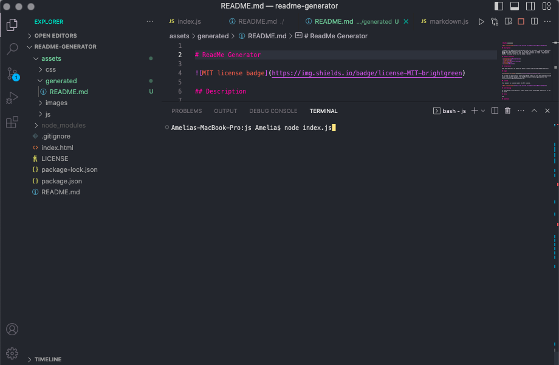

# ReadMe Generator

## Description

Week 11: Challenge 10 – ReadMe Generator

A command-line application that prompts the user to answer a series of questions about their development project, of which the answers are added to a generated ReadMe file.The application asks all of the questions to create a high-quality ReadMe, including extras such as badge creation.

## Installation

View the repository on GitHub at https://github.com/zwirled/readme-generator/

## Usage

To use the web application, please type ‘node index.js’ into the command-line and answer the question prompts. The ReadMe file will then be generated in the location ‘assets/generated/README.md’.

## License

This project is licensed under the MIT license.

## Contributing

To contribute to this project, please either clone the GitHub repository, or get in touch.

## Credits

I created the email validation with the help of this Stack Overflow thread:
https://stackoverflow.com/questions/65189877/how-can-i-validate-that-a-user-input-their-email-when-using-inquirer-npm

## Tests

N/A

## Questions

To visit my GitHub profile, please click here: https://github.com/zwirled.

If you have any questions, please send them to bramwellamelia@gmail.com and I will get back to you as soon as I can.